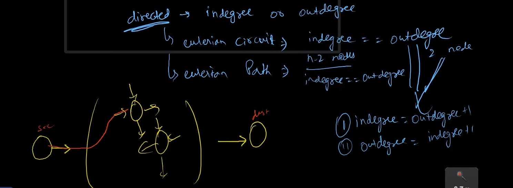

# Eulerian Path

## Defination:

The Eulerian path is an algo of graph, in which we can travel through every node/vertex while traveling the **_edges_** only **once**.

# Eulerian Circuit

## Defination:

Here the starting and end point must be same.

### Tricks

> ### undirected Graph
>
> degree even then yes, circuit is present.
>
> degree of (n-2)nodes even then path is present + 2 odd degree.

> ### directed Graph
>
> > circuit -- indegree == outdegree
>
> > path -- indegree == outdegree + (n-2)nodes
>
> 

## algorithm
